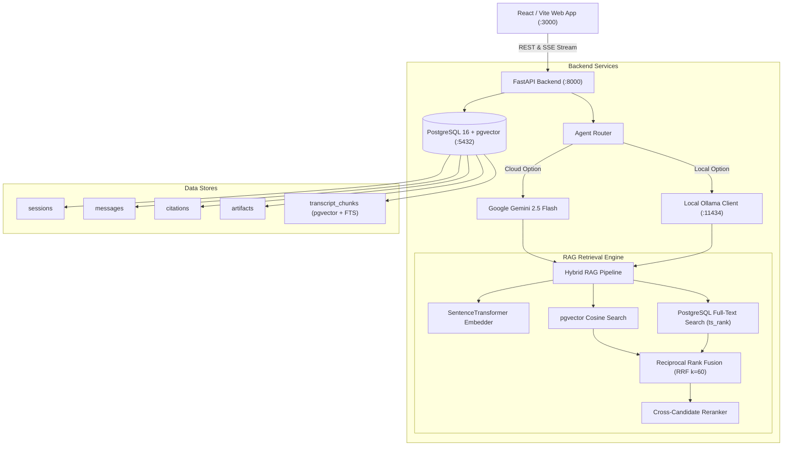
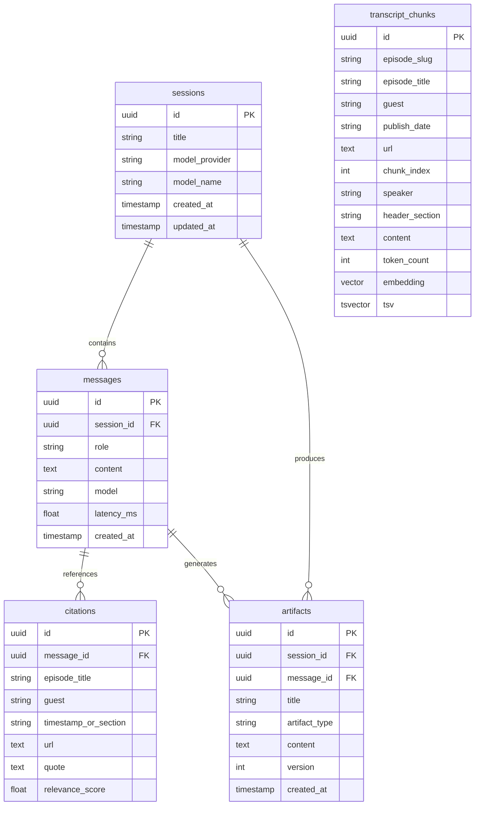
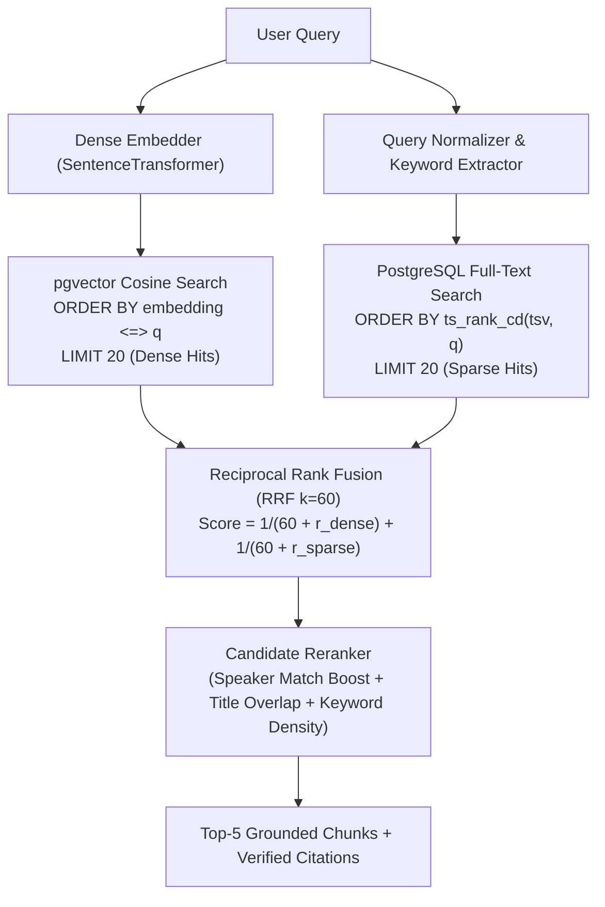

# Technical Architecture Document
## The Lenny Growth Assistant

---

## 1. System Topology

---

## 2. Database Schema (PostgreSQL with `pgvector`)

### 2.1 Entity Relationship Diagram (ERD)

---

## 3. Hybrid RAG Retrieval Pipeline (Dense + FTS + RRF + Reranking)

### 3.1 Reciprocal Rank Fusion (RRF) Formula
$$RRF(d) = \sum_{m \in \{\text{dense}, \text{sparse}\}} \frac{1}{k + rank_m(d)}$$

Where $k = 60$. Chunks matching both semantic intent and exact named entities (e.g. "Brian Chesky", "LNO framework") achieve maximum composite scores.

---

## 4. Transcript Chunking with Sliding Window Overlap

- **Target Size**: 600 tokens per chunk.
- **Sliding Overlap**: 150 tokens retained across chunk transitions.
- **Context Injection**: Every chunk automatically prepends the Episode Title, Guest Name, and Active Section Header to maintain semantic grounding.

---

## 5. Model Routing & Automatic Failover

| Selected Provider | Primary Execution | Fallback Strategy |
| :--- | :--- | :--- |
| **Google Gemini (Cloud)** | `google-genai` SDK streaming (`gemini-2.5-flash`) | Emits grounded context directly if API key is invalid/missing. |
| **Local Ollama (Local)** | Local streaming via `http://localhost:11434/api/chat` | Automatic ping health-check; fails over to Gemini if Ollama is unreachable. |

---

## 6. API Endpoints Contract

- `POST /api/v1/chat/stream`: Initiates SSE streaming session with real-time token, citation, and artifact emission.
- `GET /api/v1/sessions`: Lists all conversational sessions.
- `GET /api/v1/sessions/{id}`: Retrieves complete session history with messages, citations, and artifacts.
- `GET /api/v1/artifacts/{id}/raw`: Serves sandboxed HTML document with strict CSP headers for iframe preview.
- `GET /api/v1/health`: Verifies PostgreSQL, pgvector extension, Ollama, and Gemini connectivity.
- `POST /api/v1/ingestion/trigger`: Triggers background indexing of transcripts.
