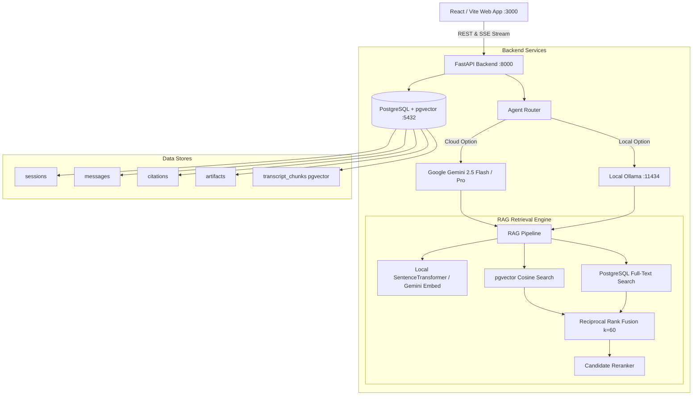

# Technical Architecture Document
## The Lenny Growth Assistant

---

## 1. System Topology



---

## 2. Database Schema (PostgreSQL with `pgvector`)

### 2.1 Entity Relationship Diagram (ERD)

```
┌─────────────────────────────────┐       ┌─────────────────────────────────┐
│            sessions             │       │            messages             │
├─────────────────────────────────┤       ├─────────────────────────────────┤
│ id (PK, UUID)                   │◄──────┤ session_id (FK, UUID)           │
│ title (VARCHAR)                 │       │ id (PK, UUID)                   │
│ model_provider (VARCHAR)        │       │ role (VARCHAR)                  │
│ model_name (VARCHAR)            │       │ content (TEXT)                  │
│ created_at (TIMESTAMP)          │       │ model (VARCHAR)                 │
│ updated_at (TIMESTAMP)          │       │ latency_ms (FLOAT)              │
└────────────────┬────────────────┘       │ created_at (TIMESTAMP)          │
                 │                        └───────┬─────────────────────────┘
                 │                                │
                 │        ┌───────────────────────┴────────────────────────┐
                 │        │                                                │
                 ▼        ▼                                                ▼
┌─────────────────────────────────┐                       ┌─────────────────────────────────┐
│            artifacts            │                       │            citations            │
├─────────────────────────────────┤                       ├─────────────────────────────────┤
│ id (PK, UUID)                   │                       │ id (PK, UUID)                   │
│ session_id (FK, UUID)           │                       │ message_id (FK, UUID)           │
│ message_id (FK, UUID)           │                       │ episode_title (VARCHAR)         │
│ title (VARCHAR)                 │                       │ guest (VARCHAR)                 │
│ artifact_type (VARCHAR)         │                       │ timestamp_or_section (VARCHAR)  │
│ content (TEXT)                  │                       │ url (TEXT)                      │
│ version (INT)                   │                       │ quote (TEXT)                    │
│ created_at (TIMESTAMP)          │                       │ relevance_score (FLOAT)         │
└─────────────────────────────────┘                       └─────────────────────────────────┘

┌───────────────────────────────────────────────────────────────────────────┐
│                             transcript_chunks                             │
├───────────────────────────────────────────────────────────────────────────┤
│ id (PK, UUID)                                                             │
│ episode_slug (VARCHAR, Index)                                             │
│ episode_title (VARCHAR)                                                   │
│ guest (VARCHAR, Index)                                                    │
│ publish_date (VARCHAR)                                                    │
│ url (TEXT)                                                                │
│ chunk_index (INT)                                                         │
│ speaker (VARCHAR)                                                         │
│ header_section (VARCHAR)                                                  │
│ content (TEXT)                                                            │
│ token_count (INT)                                                         │
│ embedding (VECTOR(384) / HNSW Index)                                      │
│ tsv (TSVECTOR / GIN Index, Computed from title + guest + section + content│
└───────────────────────────────────────────────────────────────────────────┘
```

---

## 3. Hybrid RAG Retrieval Pipeline (Dense + FTS + RRF + Reranking)

```
                      User Query
                          │
            ┌─────────────┴─────────────┐
            │                           │
            ▼                           ▼
    [Dense Embedder]             [Query Normalizer]
            │                           │
            ▼                           ▼
   [pgvector Cosine Search]    [PostgreSQL Full-Text Search]
   ORDER BY embedding <=> q    ORDER BY ts_rank_cd(tsv, q)
   LIMIT 15 (Dense Hits)       LIMIT 15 (Sparse Hits)
            │                           │
            └─────────────┬─────────────┘
                          │
                          ▼
            [Reciprocal Rank Fusion (RRF)]
            Score(d) = 1/(60 + r_dense) + 1/(60 + r_sparse)
                          │
                          ▼
            [Cross-Candidate Reranker]
            (Metadata + Keyword Density Boost)
                          │
                          ▼
            [Top-5 Grounded Chunks + Citations]
```

### 3.1 Reciprocal Rank Fusion (RRF) Formula
$$RRF(d) = \sum_{m \in \{\text{dense}, \text{sparse}\}} \frac{1}{k + rank_m(d)}$$
Where $k = 60$. Chunks matching both semantic intent and exact named entities (e.g. "Brian Chesky", "LNO framework") achieve maximum composite scores.

---

## 4. Transcript Chunking with Sliding Window Overlap

- **Target Size**: 600 tokens per chunk.
- **Sliding Overlap**: 150 tokens retained across chunk transitions.
- **Context Injection**: Every chunk automatically prepends the Episode Title, Guest Name, and Active Section Header to maintain semantic grounding.

---

## 5. Model Routing & Automatic Failover

| Selected Provider | Primary Execution | Fallback Strategy |
| :--- | :--- | :--- |
| **Google Gemini (Cloud)** | `google-genai` SDK streaming (`gemini-2.5-flash`) | Emits grounded context directly if API key is invalid/missing. |
| **Local Ollama (Local)** | Local streaming via `http://localhost:11434/api/chat` | Automatic ping health-check; fails over to Gemini if Ollama is unreachable. |

---

## 6. API Endpoints Contract

- `POST /api/v1/chat/stream`: Initiates SSE streaming session with real-time token, citation, and artifact emission.
- `GET /api/v1/sessions`: Lists all conversational sessions.
- `GET /api/v1/sessions/{id}`: Retrieves complete session history with messages, citations, and artifacts.
- `GET /api/v1/artifacts/{id}/raw`: Serves sandboxed HTML document with strict CSP headers for iframe preview.
- `GET /api/v1/health`: Verifies PostgreSQL, pgvector extension, Ollama, and Gemini connectivity.
- `POST /api/v1/ingestion/trigger`: Triggers background indexing of transcripts.
