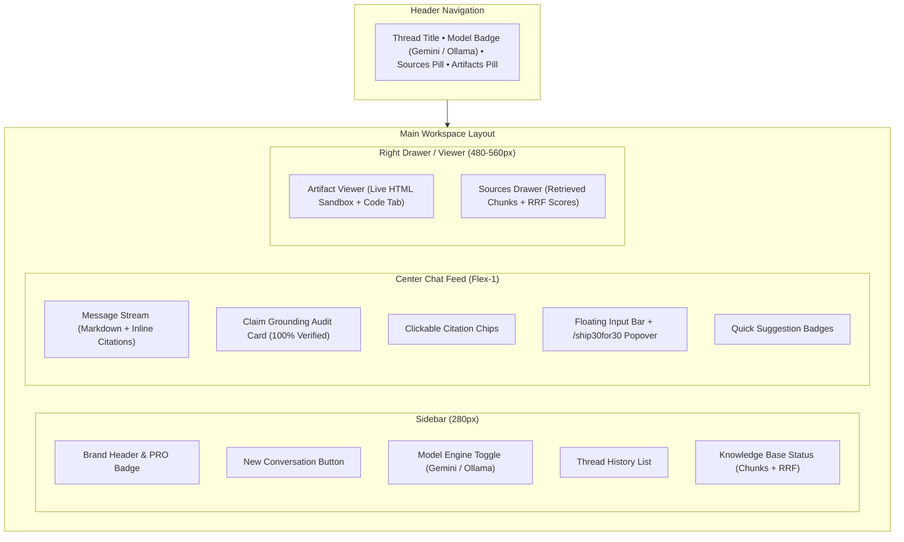

# Design Specifications & UI/UX Architecture
## The Lenny Growth Assistant

---

## 1. UI/UX Design Philosophy & Aesthetic Standard

1. **High-Signal Craftsmanship**: Built with the precision and visual hierarchy of modern developer & operator tools (e.g. Linear, Raycast, Perplexity Pro). Zero AI slop, zero generic clutter.
2. **Context-Aware Visual Hierarchy**: Content is strictly separated into conversational dialogue, verified transcript citations, and reusable artifacts (HTML/Markdown).
3. **Deep Royal Navy & Ocean Azure Surfaces**: Refined dark theme palette (`#070F1E`, `#0D1B33`, `#0D47A1`) with subtle borders, smooth radial backdrops, and translucent blurred surfaces.
4. **Instant Visual Feedback**: Smooth token-by-token streaming, non-blocking SSE delivery, interactive citation cards, and side-by-side artifact rendering.

---

## 2. Layout & Component Architecture

---

## 3. Key Interaction States

### 3.1 Conversational Streaming
- **Thinking State**: During RAG retrieval and reranking, a pulsing stage indicator displays real-time progress (`Searching transcript knowledge base...`).
- **Token Delivery**: Smooth 16-character SSE token rendering at $100+\text{ tokens/sec}$ without thread blocking.
- **Latency & Model Badges**: Assistant messages display dynamic model name (`Gemini 3.1 Flash Lite` or `qwen2.5:1.5b`) and round-trip execution latency (`1.42s`).

### 3.2 Claim Grounding & Citations Flow
1. Grounded responses display an interactive **Claim Grounding Audit Card** (`100% Grounded in Transcripts`) with an expandable evidence breakdown.
2. Inline citation chips (`[1 Brian Chesky]`) link directly to timestamped transcript sources.
3. Clicking a citation opens the slide-over **Sources Drawer**, highlighting the exact transcript chunk with its RRF relevance score.

### 3.3 Side-by-Side Artifact Workspace
1. When asked for frameworks, checklists, or interactive tools, the assistant generates structured HTML/Markdown artifacts.
2. The split-screen **Artifact Viewer** renders live interactive HTML in a secure sandboxed iframe (`sandbox="allow-scripts"`).
3. Users can toggle between **Preview** (interactive execution) and **Source** (syntax-highlighted code with 1-click copy & file download).

---

## 4. Color Palette & Design Tokens

| Token | Hex / RGBA | Usage |
| :--- | :--- | :--- |
| **`--bg-canvas`** | `#070F1E` | Deep midnight navy background |
| **`--bg-surface`** | `#0D1B33` | Card backgrounds & message bubbles |
| **`--bg-elevated`** | `#0D47A1` | User active bubble & elevated surfaces |
| **`--accent-azure`** | `#2196F3` | Primary brand highlights, send CTA, and active toggles |
| **`--accent-sky`** | `#90CAF9` | Citations, metadata chips, and code annotations |
| **`--accent-orange`** | `#F97316` | `/ship30for30` skill badges and Model Engine controller |
| **`--accent-emerald`** | `#10B981` | Knowledge base status badge & 100% grounding checkmarks |
